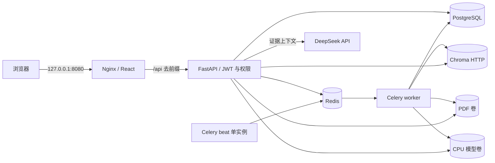

# 企业版架构与演示

系统把账号、手册元数据和任务状态保存在 PostgreSQL；Chroma 使用独立 HTTP 服务保存向量；Redis 为 Celery 提供共享队列。PDF 与嵌入模型使用独立数据卷。API 与 worker 使用同一个 CPU 后端镜像，beat 独立运行周期任务。

## 主要流程

登录后，浏览器携带访问令牌调用 API。权限在服务端校验，管理员功能不只依赖前端隐藏按钮。上传 PDF 后 API 保存文件与任务记录，再由 worker 执行解析、分块和向量化；前端读取任务状态显示结果。beat 提供定时恢复任务的执行入口，应与 worker 分开部署且只运行一个实例。

问答沿用车型隔离、向量与 BM25 混合检索、RRF 融合及引用页码去重。模型从挂载目录离线加载，检索证据再发送给 DeepSeek 生成回答。资料不足时返回明确拒答，不能把无证据回答伪装成维修建议。

数据库与向量库是两个独立存储，导入/删除不能依靠单个数据库事务实现跨库原子性；需要任务状态、重复执行保护与失败恢复共同保持一致。恢复演练必须同时检查元数据、文件和检索结果，不能只检查容器为绿色。

## 十分钟演示顺序

1. 展示 `docker compose ps`，说明仅网关发布本机端口，以及模型事先下载、业务运行离线加载。
2. 使用管理员账号登录，展示手册管理和任务列表。上传一份已确认来源可用的 PDF，等待完成。
3. 选择该车型提出有证据的问题，展开答案引用，核对手册标题、PDF 物理页码和原文。
4. 切换资料不足的车型，展示有依据的拒答。避免把演示用题或本地数据状态说成普遍准确率。
5. 使用普通账号验证管理员操作受限；展示手册、版本和导入任务记录，说明业务状态由服务端保存。
6. 展示失败任务与错误信息、服务 health、离线测试和服务集成测试的实际运行记录。
7. 展示一次备份 manifest 和独立恢复项目，说明原数据卷未被覆盖。

演示前按实际导入状态选择车型；新 Compose 数据卷不包含开发机原有手册或索引。当前仓库只包含代码和可公开的测试资料，不能宣称开箱就带有完整汽车原厂资料。

## 适用范围

该实现覆盖单机部署中的账号权限、异步处理、持久化、健康检查、备份恢复和可重复测试。它尚不等同于经过生产认证的多租户平台：公网部署前应按实际环境设计 TLS、域名、访问范围、密钥管理、容量规划、监控和数据留存。默认 `127.0.0.1` 绑定适合本机演示，不应直接替换为公网绑定。

部署命令、故障处理和恢复流程见 [部署文档](enterprise-deployment.md)。检索指标沿用现有 [README](../README.md) 的指标定义，不以新增工程功能推断检索准确率提升。
