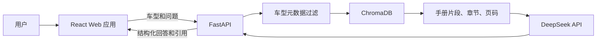

# 汽车维修手册 RAG：项目设计

## 目标

构建一个面向车主和维修技师的 Web 应用。用户选择品牌、车型和年份后，可基于对应的原厂公开手册提出问题。系统给出有手册依据的回答、操作步骤、注意事项及章节和页码引用；缺少可靠依据时明确拒答。

第一版作为简历项目，优先证明车型隔离、可追溯引用和可靠拒答，不实现账号、聊天历史、后台管理或预约服务。

## 首批知识库

第一版保留三种车型选择：

- 比亚迪海豹
- 丰田卡罗拉
- 本田思域

仓库只内置自行编写、标明为演示用途的保养与故障说明片段，不存放或分发完整原厂手册。用户可上传自己拥有的 PDF；系统只在本地运行期间为该文件建立索引。README 记录官方资料入口及版权状态。

## 架构



前端负责车型选择、提问、展示回答及引用卡片。FastAPI 负责请求校验、按车型过滤检索、调用 DeepSeek 和返回结构化响应。ChromaDB 保存向量和手册元数据。

DeepSeek 通过 OpenAI 兼容接口调用，密钥只保存在后端环境变量 `DEEPSEEK_API_KEY` 中。模型名称可通过环境变量配置，以便后续替换而无需改变检索流程。

## 数据导入与检索

开发者通过导入脚本处理手册：

1. 从 PDF 提取文本、页码和目录层级。
2. 依照章节边界与语义段落切分文本，避免将同一维修步骤拆散。
3. 为每个片段写入 `brand`、`model`、`year`、`manual_title`、`chapter_title`、`page_number` 和原文。
4. 生成嵌入并写入 ChromaDB。

问答请求必须包含有效车型。检索器先使用品牌、车型和年份过滤，再在该范围内查询相似片段。只有检索结果达到预设相关性阈值时，才将片段交给模型。

## 用户流程

应用包含三个页面：

1. 首页：选择品牌、车型和年份，进入问答页。
2. 问答页：输入问题并显示结构化回答、安全提示和引用卡片。
3. 手册浏览页：展示当前车型的演示知识目录；用户上传后显示本次会话已解析的章节。

回答固定包含以下字段：

- `answer`：结论。
- `steps`：有明确手册依据时的操作步骤。
- `warnings`：安全或使用注意事项。
- `citations`：手册标题、章节标题、页码和引用原文摘要。
- `grounded`：是否获得足够手册依据。

若没有选择车型、车型不受支持、检索不足，或问题涉及危险操作但资料没有依据，系统返回 `grounded: false`，说明无法从当前手册确认，并建议查阅原厂资料或咨询专业技师。模型提示词禁止编造参数、步骤、部件位置或故障原因。

## 项目结构

```text
car-manual-rag/
├─ backend/
│  ├─ app/
│  │  ├─ api/          # 车型、目录、问答接口
│  │  ├─ rag/          # 检索、提示词、DeepSeek 调用
│  │  └─ schemas/      # 请求与响应模型
│  ├─ scripts/         # PDF 导入与向量化
│  └─ data/            # 手册与 ChromaDB 数据
├─ frontend/
│  └─ src/             # React 页面与组件
├─ docs/               # 数据来源、测试题和说明
└─ README.md
```

## API

- `GET /vehicles`：可选的品牌、车型和年份。
- `GET /manuals/{vehicleId}/chapters`：当前车型的手册目录。
- `POST /chat`：接收 `vehicleId` 与 `question`，返回结构化回答和引用。

## 验收与测试

第一版完成条件：

- 三个预置车型均可提问。
- 检索和回答不会跨车型使用资料。
- 有依据的回答至少含一个章节和页码引用。
- 无依据、空问题和未选择车型时，返回明确且安全的提示。
- 本地可完整演示“选择车型 → 提问 → 查看引用”。

准备固定测试问题，覆盖保养周期、仪表提示和轮胎相关内容。测试既检查答案是否有引用，也检查引用是否来自正确车型和正确页码。

## 非目标

- 用户登录和聊天记录。
- 后台手册审核和集中式手册存储。
- 预约、报价、配件购买。
- 基于未验证互联网信息生成维修方案。

