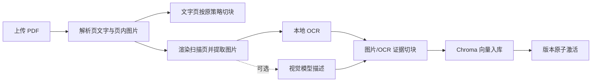

# 汽车手册 RAG：OCR 与图文资料处理设计

## 目标

让系统能导入两类现有流程无法完整利用的资料：扫描版 PDF，以及含有故障灯、线路图、示意图或图片表格的 PDF。保留当前按车型、手册版本和 PDF 页码过滤检索的约束；每一条新证据都必须能回到原始 PDF 页。

本期默认能力是本地、CPU 可运行的中文 OCR。图片语义理解是可选能力：未配置视觉模型时，系统仍能完成导入、检索 OCR 文本和打开原文页。

## 范围和取舍

* 默认使用本地 ONNX OCR 运行时和中文模型；不需要 API Key，也不依赖 Tesseract 可执行文件。
* 文字型 PDF 继续使用 `pypdf` 提取文本。仅当该页没有可用文字，或图片中含文字时，才对页面渲染图及抽取图片运行 OCR。
* 图片将保存为手册版本的受限资产，记录 SHA-256、页码、图片序号、尺寸和 OCR 文本。原始 PDF 始终是引用来源；不对图片本身分配独立、不可追溯的引用。
* 视觉模型采用可选的 OpenAI 兼容接口。未设置视觉模型配置时，只生成 OCR 文本，不尝试臆测图像含义。默认不下载本地大语言视觉模型，避免给普通 CPU 部署增加数 GB 的模型和不可控启动时间。
* 不做复杂版面重建、CAD 线路拓扑还原或图片问答专用前端。本期目标是让图像中的文字及简洁视觉描述进入既有 RAG，并让用户在引用处回到 PDF 页。

## 数据模型

新增 `ManualAsset` 表，归属 `manual_version`：

* `id`、`version_id`、`sha256`、`file_path`
* `page_number`、`asset_index`、`width`、`height`
* `ocr_text`、`visual_description`、`processing_status`、`error`

同一版本内以 `(page_number, asset_index, sha256)` 去重。文件保存在现有 `manuals` 持久化卷中、版本专属目录下，下载和预览接口都要求登录，并验证版本与资产归属。

`ManualVersion.processing_config` 增加 OCR、渲染 DPI 和视觉模型是否启用的快照。此记录解释某个版本为何有或没有图像证据。

## 导入流程



每一页先提取文字；若文字少于最小有效长度，则以 200 DPI 渲染整页用于 OCR。抽取出的有效图片也 OCR，避免漏掉图表中没有出现在页面文字层的标签。OCR 结果按原始页码走现有 900 字符、120 字符重叠窗口切块；图片块元数据额外包含 `asset_id`、`asset_index` 和 `evidence_type`（`pdf_text`、`page_ocr`、`image_ocr` 或 `image_description`）。

导入任务的步骤扩展为 `parsing → ocr → embedding → succeeded`。OCR 依赖暂时不可用时按现有基础设施重试策略重试；空白或无法识别的图片不会使整本有文字的手册失败。仅当整份 PDF 没有可用文字、没有可用 OCR 结果时，任务才以可解释错误结束。

## 检索与回答

现有车型、启用手册和活动版本的过滤对所有证据类型保持不变。混合检索把 OCR 片段和常规文本作为同一候选集处理；检索结果会携带证据类型和资产标识。

回答提示词可见 `evidence_type`，但引用编号仍由服务端验证。引用以 `(version_id, page_number, asset_id 可选)` 去重：同页多个常规文本块只显示一条；同页不同图片可以分别显示。前端为图片证据增加“查看关联图片”按钮，普通文字引用继续显示“查看 PDF 第 N 页”。

视觉描述只有在显式启用并成功调用视觉模型时才进入索引；描述中会标记其为模型生成，不能冒充手册原文。生成最终维修结论时，提示词仍要求模型仅依据给定证据，不得把视觉描述中不存在的扭矩、零件号或操作步骤当成确定事实。

## 配置和部署

新增配置：

```env
OCR_ENABLED=true
OCR_LANGUAGE=ch
OCR_RENDER_DPI=200
VISION_ENABLED=false
VISION_BASE_URL=
VISION_API_KEY=
VISION_MODEL=
```

OCR 模型在 `prepare-model` 阶段预下载至新持久化模型卷，运行时保持离线；Docker Compose 增加此卷和就绪检查。OCR 默认开启，配置缺失时使用上述默认值。视觉配置缺失且 `VISION_ENABLED=false` 时正常运行；若显式启用但缺少 URL、模型或密钥，导入任务以配置错误失败，不静默降级为视觉描述。

## 测试与验收

单元测试覆盖：

1. 扫描页 OCR 文本生成带原页码的块；
2. 纯文字页不触发页面 OCR；
3. 图片 OCR 块含版本、页码和资产元数据；
4. 重试导入不会创建重复资产或重复块；
5. 视觉功能关闭时不调用视觉客户端；
6. 视觉描述失败不破坏已有文字和 OCR 证据；
7. 用户无权读取他人未授权的资产，普通用户仍不能管理资料；
8. 引用去重不会合并同页不同图片。

集成验收使用自编双页 PDF：一页有可提取文本，一页是含中文故障灯说明的渲染图。期望该版本激活后，可检索到第二页 OCR 文本，返回的引用页码为 2，并能经登录接口查看关联图片。视觉模型使用模拟 OpenAI 兼容服务验证请求和失败处理，不使用收费 API。

## 已知限制

本期 OCR 质量依赖原稿清晰度；低清晰度线路图和复杂合并单元格表格仍可能识别不完整。可选视觉描述是辅助检索证据，不替代经过授权的维修文字或人工审核。后续若有真实、合规的图文手册与 GPU 资源，可评估专用本地视觉模型和版面理解模型。
